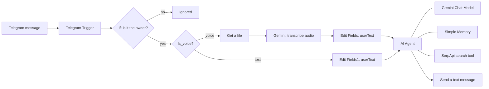

# Telegram AI Assistant with n8n and Google Gemini

A private AI assistant on Telegram, built with **n8n** (low-code automation) and **Google Gemini**. It answers questions on any topic, understands **voice messages**, can **search the web**, remembers the recent conversation, and replies **only to its owner**.

> Built as a learning project. No custom server code: everything is an n8n workflow.

## Features

- Text chat on any topic (general assistant, also useful for research and writing)
- Voice messages: the audio is downloaded from Telegram and transcribed by Gemini
- Web search tool (SerpApi) for current information, with sources
- Short-term conversation memory per chat
- Owner-only access: messages from other Telegram accounts are ignored
- Plain-text replies, so Telegram never rejects the formatting
- Automatic retries when the free AI tier is busy

## How it works



## Tech stack

| Part | Tool |
|---|---|
| Automation / orchestration | n8n (self-hosted on a local machine) |
| Chat interface | Telegram Bot API (bot created with @BotFather) |
| AI model | Google Gemini (chat + audio transcription) |
| Web search | SerpApi |
| Public HTTPS tunnel (local setup) | ngrok |

## Prerequisites

- n8n installed and running (default port 5678)
- A Telegram account
- A Google AI Studio API key (free tier available)
- A SerpApi API key (optional, for web search)
- An ngrok account (only if n8n runs on your own computer)

## Setup

### 1. Create the Telegram bot
1. Open **@BotFather** in Telegram and send `/newbot`.
2. Choose a display name and a unique username ending in `bot`.
3. Copy the token. **Never commit it to Git.**

### 2. Give n8n a public HTTPS address (local installs only)
Telegram can only call webhooks over public HTTPS.

```bash
ngrok config add-authtoken <YOUR_NGROK_TOKEN>
ngrok http 5678
```

Restart n8n with the ngrok address as `WEBHOOK_URL`.

PowerShell (npm install):
```powershell
$env:WEBHOOK_URL="https://<your-domain>.ngrok-free.dev"; n8n start
```

Docker:
```bash
docker run ... -e WEBHOOK_URL="https://<your-domain>.ngrok-free.dev" ...
```

### 3. Import the workflow
1. In n8n: **Workflows → Import from file** and choose `workflow.json`.
2. Create these credentials (they are not stored in the exported file):
   - Telegram API (bot token)
   - Google Gemini (PaLM) API key
   - SerpApi key
3. In the **If** node, replace `<YOUR_TELEGRAM_USER_ID>` with your own numeric Telegram ID.

### 4. Publish
Click **Publish**, then message your bot.

> Do **not** click *Execute workflow* while the workflow is published. Telegram allows only one webhook per bot, and test executions replace the live one.

## Workflow explained

| Node | What it does |
|---|---|
| **Telegram Trigger** | Receives every message sent to the bot. |
| **If** | Compares `message.from.id` with the owner's ID. Only the `true` output continues, so strangers get no answer and cannot use your AI quota. |
| **Is_voice** | Checks if the message contains a voice note (`message.voice.file_id` is not empty). |
| **Get a file** | Downloads the voice note from Telegram (OGG/Opus audio). |
| **Transcribe a recording** | Gemini converts the audio to text (input type: binary, field `data`). |
| **Edit Fields / Edit Fields1** | Both branches write the user's words into one field, `userText`, so the agent has a single input. |
| **AI Agent** | Gemini chat model + system prompt + tools + memory. Retry on fail is enabled. |
| **Simple Memory** | Keeps the recent exchanges, with the Telegram chat ID as the session key. |
| **SerpApi tool** | Lets the agent search Google when it needs fresh information. |
| **Send a text message** | Sends the answer back to the same chat. Parse mode is set to HTML and the n8n attribution line is turned off. |

### Key expressions

| Where | Expression |
|---|---|
| Voice check | `{{ $json.message.voice?.file_id }}` |
| File to download | `{{ $json.message.voice.file_id }}` |
| Text path | `{{ $json.message.text }}` |
| Agent prompt | `{{ $json.userText }}` |
| Chat ID (reply and memory key) | `{{ $('Telegram Trigger').first().json.message.chat.id }}` |

Using `.first()` instead of `.item` keeps the chat ID reachable after the data passes through the voice branch.

### System prompt (summary)
The assistant is a friendly general helper that replies in the user's language, uses the search tool for current information, never invents facts or references, and writes **plain text only** (no `*`, `_`, `#`, or backticks; section titles in capitals; numbered lists as `1) 2) 3)`).

## Lessons learned / troubleshooting

| Problem | Cause | Fix |
|---|---|---|
| Bot never receives messages | Tunnel is down, n8n started without `WEBHOOK_URL`, or a test execution replaced the webhook | Start ngrok first, start n8n with `WEBHOOK_URL`, unpublish and publish again. Avoid the Execute buttons while published. |
| `Bad request: can't parse entities` | AI wrote Markdown symbols that Telegram could not parse | Plain-text rule in the system prompt and Parse Mode = HTML on the send node. |
| `503 Service unavailable` from Gemini | Preview models are often overloaded on the free tier | Use a stable alias such as `models/gemini-flash-latest` and enable Retry On Fail (3 tries, 3000 ms). |
| `404 model no longer available` | A fixed model version was retired for new accounts | Use the `-latest` alias instead of a pinned version. |
| Voice message gets no reply | Wrong input type or field name, or model not available | Input type = Binary File(s), field name = `data`, supported model. |
| Executions view cannot be edited | It is a read-only snapshot of a past run | Make changes in the **Editor** tab. |

## Security notes

- Keep all tokens and API keys in n8n credentials, never in the repository.
- Before sharing an exported workflow, **unpin any pinned data** on the Telegram Trigger (it can contain your name and chat ID) and replace your Telegram ID with a placeholder.
- Do not publish your ngrok URL: it exposes your n8n login page. Use a strong n8n password.
- The AI can produce wrong facts or invented references. Verify anything important, especially citations for academic work.

## Limitations

- Runs only while the computer, n8n, and ngrok are running (no 24/7 hosting yet).
- Simple Memory is stored in n8n's process and is lost on restart.
- Free-tier rate limits and overloads can delay answers.
- Replies are text only (no spoken replies).
- Single user (the owner).

## Roadmap

- Host n8n on a server for 24/7 availability
- Persistent memory (database)
- Spoken replies (text-to-speech)
- Read PDFs and documents for literature review
- Multi-user mode with an allow-list

## License

MIT (or your choice). Replace this section before publishing.
